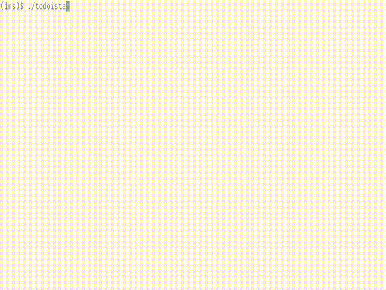

# A basic terminal/CLI interface for using todoist: todoista

This is meant as a project to help me learn GO and as such is in major flux and
lacks features/documentation right now.



## Configuration / Usage

The only configuration variable currently is the todoist API Token, it should
be supplied via the environment variable `TODOISTA_KEY`

Example launch:

```bash
TODOISTA_KEY=1234abcd ./todoista
```

## Keybindings

- [a] Add task
- [q] Quit
- [s] Sync (grab items & projects)
- [p] Go to projects screen
- [m] Go to messages screen
- [<enter>] On an Item to complete it, on a Project to view its Items


## TODO

- Configurable keybindings
- Tests
- Put incremental sync loading into goroutine
- Edit Item
- Correct visibility issues and naming
